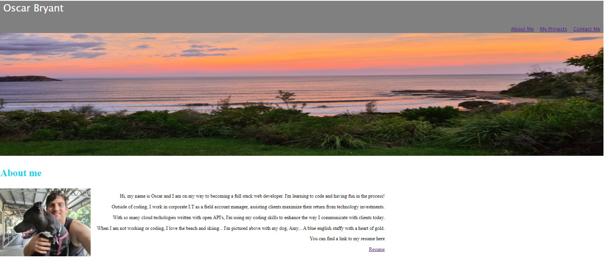

# Portfolio-3 - Oscar Bryat

# Task
This week, we we asked to generate a new Portfolio page that showcases our projects to date. We needed to showcase more recent examples of the work we have produced during our bootcamp so far. In addition, we needed to link our professional documentation to linkedin, github and our CV. 

# User Stories
There were no user stories assinged to this task, but we needed to make sure the page was responsive, well designed and hosted links that worked when we wanted to select other pages.

We were tasked with deploying coding practices we have learnt during class over the past few months.

We needed to ensure the project had numerous commits with code written cleanly and professionally.

# Outcome

You can access our most up-to-date profile page here: https://oscarcbryant.github.io/Portfolio-3/

Here is a screenshot of our portfolio:

# Technologies Used

HTML
CSS
JavaScript
Icon Libraries

## About the Author

This project was written and submitted by: 

Oscar Bryant
https://github.com/oscarcbryant

March 28th, 2022
